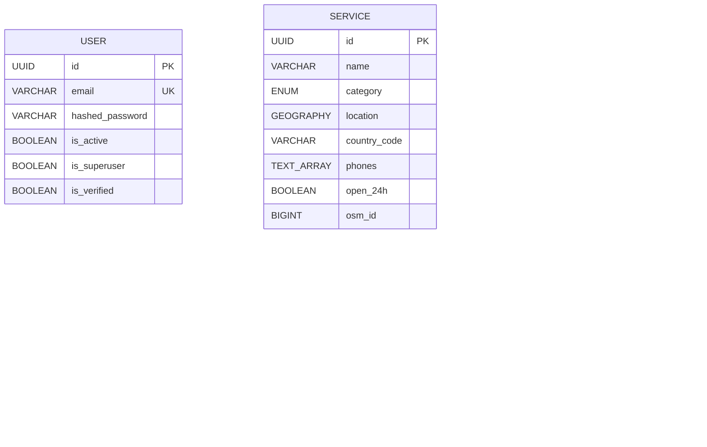

<div align="center">

# 🛣️ ROADSoS

### *Emergency Services at Your Fingertips — When Every Second Counts*

[](https://fastapi.tiangolo.com)
[](https://postgis.net)
[](https://redis.io)
[](https://expo.dev)
[](https://docs.docker.com/compose/)
[](LICENSE)

**ROADSoS** is a real-time emergency services locator platform that helps users find the nearest hospital, police station, ambulance, towing service, and more — with geospatial precision, bystander coordination, and offline-first capabilities.

[🚀 Quick Start](#-quick-start) · [📖 Documentation](#-documentation) · [🏗️ Architecture](#️-architecture) · [📱 Mobile App](#-mobile-app) · [🗄️ Database](#️-database) · [🔌 API Reference](#-api-reference)

</div>

---

## 🎯 Problem Statement

> **Every year, thousands of road accident victims die not from the severity of their injuries, but from delayed emergency response.**

In rural areas, highway stretches, and unfamiliar cities — finding the nearest hospital, knowing the right emergency number, or coordinating bystanders at a crash scene is a life-or-death challenge. Existing solutions (Google Maps, 112) are either too generic, require internet connectivity, or don't address the coordination problem.

**ROADSoS solves this by providing:**
- 📍 **Nearest Emergency Services** — Geospatial radius search powered by PostGIS
- 📞 **Country-Specific Emergency Numbers** — 21+ countries, always available offline
- 🚨 **Incident Reporting & Triage** — Report emergencies with severity classification
- 🤝 **Bystander Coordination** — Distribute roles ("direct traffic", "call ambulance", "stay with victim") among nearby helpers
- 📴 **Offline-First Design** — Service Worker + downloadable offline bundles for zero-connectivity scenarios
- 📊 **Real-Time Telemetry** — 5-second location pings stored in Redis ring buffers

---

## 🏗️ Architecture

```
                           ┌─────────────────┐
                           │   Mobile App    │
                           │  (Expo / PWA)   │
                           └────────┬────────┘
                                    │ HTTPS
                           ┌────────▼────────┐
                           │     Nginx       │
                           │  Reverse Proxy  │
                           └────────┬────────┘
                                    │
                           ┌────────▼────────┐
                           │    FastAPI      │
                           │   (Uvicorn)     │
                           │   Port 8000     │
                           └───┬────────┬────┘
                               │        │
                 ┌─────────────▼──┐  ┌──▼─────────────┐
                 │  PostgreSQL 16 │  │    Redis 7      │
                 │  + PostGIS 3.4 │  │                 │
                 │                │  │  • Geo Cache    │
                 │  • Services    │  │  • Telemetry    │
                 │  • Incidents   │  │  • Celery Broker│
                 │  • Users       │  │                 │
                 └────────────────┘  └──┬──────────────┘
                                        │
                              ┌─────────┴──────────┐
                        ┌─────▼──────┐   ┌─────────▼───────┐
                        │   Celery   │   │   Celery Beat   │
                        │   Worker   │   │   (Scheduler)   │
                        │ 4 procs    │   │                 │
                        └────────────┘   └─────────────────┘
```

### Service Inventory (Docker Compose)

| Service | Image | Port | Role |
|---|---|---|---|
| `api` | `python:3.11-slim` | 8000 | FastAPI + Uvicorn application server |
| `db` | `postgis/postgis:16-3.4-alpine` | 5432 | PostgreSQL with PostGIS geospatial extension |
| `redis` | `redis:7-alpine` | 6379 | In-memory cache + Celery message broker |
| `celery_worker` | `python:3.11-slim` | — | Background task processor (4 concurrent) |
| `celery_beat` | `python:3.11-slim` | — | Periodic task scheduler |
| `nginx` | `nginx:alpine` | 80, 443 | Reverse proxy with header propagation |

---

## 🚀 Quick Start

### Prerequisites

- [Docker Desktop](https://www.docker.com/products/docker-desktop/) (v20.10+)
- [Docker Compose](https://docs.docker.com/compose/) (v2.0+)

### 1. Clone & Configure

```bash
git clone https://github.com/your-org/roadsos-backend.git
cd roadsos-backend
```

Create a `.env` file:

```env
DATABASE_URL=postgresql+asyncpg://roadsos:roadsos@db/roadsos
REDIS_URL=redis://redis:6379/0
SECRET_KEY=your_secure_secret_key_here
```

### 2. Launch All Services

```bash
docker compose up --build
```

This starts all 6 services. The API will be ready in ~30 seconds.

### 3. Run Database Migrations

```bash
docker compose exec api alembic upgrade head
```

### 4. Verify

```bash
# Health check
curl http://localhost:8000/health
# → {"status": "healthy"}

# Swagger UI
open http://localhost:8000/docs
```

### 5. Seed Sample Data (Optional)

```bash
docker compose exec api python scripts/verify_system.py
```

---

## 📱 Mobile App

The frontend is a cross-platform mobile application built with **React Native + Expo**, targeting iOS, Android, and Web from a single codebase.

### Running the Mobile App

```bash
cd frontend
npm install

# Web (Vite dev server)
npm run web

# iOS Simulator
npm run ios

# Android Emulator
npm run android
```

### Key Features

| Feature | Description |
|---|---|
| 🏠 **Home Screen** | One-tap access to all emergency categories |
| 🗺️ **Nearby Services** | Real-time geospatial search with distance display |
| 🚨 **Emergency Flow** | Triage → report → bystander coordination in 3 taps |
| 🩺 **CPR Guide** | Step-by-step CPR instructions with visual guide |
| 📋 **Accident Report** | Structured accident documentation form |
| 🔔 **Safe Arrival** | Timer-based check-in with emergency contact alerts |
| 🌐 **Multi-Language** | English, Hindi, Gujarati |
| 📴 **Offline Mode** | Full functionality without internet |

### State Management

Global state is managed via **Zustand** with automatic `AsyncStorage` persistence:

```
User Profile → Emergency Contacts → Medical Details (blood group, allergies)
         ↓
  Incident State → Emergency Type → Triage Level → Location → Bystander Roles
         ↓
   Safe Arrival → Deadline Timer → Contact Alerts
```

---

## 🗄️ Database

### PostGIS-Powered Geospatial Engine

ROADSoS uses **PostgreSQL 16 + PostGIS 3.4** with `Geography(POINT, SRID 4326)` columns for accurate spheroidal distance calculations.

```sql
-- "Find all hospitals within 25km of me, sorted by distance"
SELECT name, address,
       ST_Distance(location, ST_MakePoint(72.87, 19.07)::geography) / 1000 AS distance_km
FROM services
WHERE ST_DWithin(location, ST_MakePoint(72.87, 19.07)::geography, 25000)
  AND category = 'HOSPITAL'
  AND is_active = true
ORDER BY distance_km;
```

### Entity-Relationship Diagram



### Full Database Documentation

See [`hackathon_db_submission/database_architecture.md`](hackathon_db_submission/database_architecture.md) for:
- Complete column-level table breakdowns
- Enum definitions
- PostGIS spatial indexing strategy
- Redis caching layer documentation

---

## 🔌 API Reference

Base URL: `http://localhost:8000/api/v1`

### Services — Emergency Service Lookup

| Method | Endpoint | Description |
|---|---|---|
| `GET` | `/services/nearby?lat=19.07&lng=72.87&radius=25000` | Find services within radius (meters) |
| `GET` | `/services/nearby?lat=19.07&lng=72.87&category=HOSPITAL` | Filter by category |
| `GET` | `/services/{id}` | Get service details by ID |
| `GET` | `/services/offline-bundle/download?lat=19.07&lng=72.87` | Download 50km offline bundle |
| `POST` | `/services/{id}/alert` | Send alert to a service |
| `POST` | `/services/flags` | Flag inaccurate service data |

### Incidents — Emergency Event Management

| Method | Endpoint | Description |
|---|---|---|
| `POST` | `/incidents/` | Report a new incident |
| `GET` | `/incidents/nearby?lat=19.07&lng=72.87&radius=200` | Find active incidents nearby |
| `PATCH` | `/incidents/{id}/status` | Update incident status |
| `POST` | `/incidents/{id}/roles/{role_id}/assign` | Claim a bystander role |

### Emergency Numbers

| Method | Endpoint | Description |
|---|---|---|
| `GET` | `/emergency-numbers?country_code=IN` | Get country-specific emergency numbers |

### Telemetry

| Method | Endpoint | Description |
|---|---|---|
| `POST` | `/telemetry/ping` | Submit location ping (5-second intervals) |

### Authentication

| Method | Endpoint | Description |
|---|---|---|
| `POST` | `/auth/register` | Register a new user |
| `POST` | `/auth/jwt/login` | Login (returns JWT token) |

### Admin (🔒 Superuser Required)

| Method | Endpoint | Description |
|---|---|---|
| `GET` | `/admin/flags` | View pending service data flags |
| `GET` | `/admin/incidents` | View all reported incidents |

> 📄 **Full Swagger Documentation** available at `http://localhost:8000/docs` when running locally.

---

## 🛡️ Security

| Measure | Implementation |
|---|---|
| **Authentication** | JWT Bearer tokens (1-hour lifetime) via FastAPI-Users |
| **Password Hashing** | bcrypt with passlib |
| **CORS** | Configurable origin allowlist |
| **Error Sanitization** | Global exception handler strips stack traces from API responses |
| **Admin Protection** | Superuser-only dependency injection on admin endpoints |
| **IP Logging** | `X-Forwarded-For` header parsing for telemetry behind Nginx |

---

## 📂 Project Structure

```
roadsos_backend/
├── app/
│   ├── api/v1/
│   │   ├── endpoints/
│   │   │   ├── services.py       # Geospatial service lookup
│   │   │   ├── incidents.py      # Incident CRUD + bystander roles
│   │   │   ├── emergency.py      # Country emergency numbers
│   │   │   ├── telemetry.py      # Location ping ingestion
│   │   │   └── admin.py          # Protected admin endpoints
│   │   └── api.py                # Route aggregation
│   ├── core/
│   │   ├── config.py             # Pydantic-settings configuration
│   │   ├── celery_app.py         # Celery worker setup
│   │   ├── cache.py              # Redis cache manager
│   │   ├── users.py              # FastAPI-Users + JWT auth
│   │   └── exceptions.py         # Global error handler
│   ├── db/
│   │   ├── base_class.py         # SQLAlchemy declarative base
│   │   └── session.py            # Async session factory
│   ├── models/
│   │   ├── user.py               # User model (FastAPI-Users)
│   │   ├── service.py            # Emergency service model (PostGIS)
│   │   └── incident.py           # Incident + roles model
│   ├── schemas/
│   │   ├── user.py               # User Pydantic schemas
│   │   ├── service.py            # Service request/response schemas
│   │   ├── incident.py           # Incident schemas
│   │   └── telemetry.py          # Telemetry ping schema
│   ├── tasks/
│   │   └── sync.py               # OSM data ingestion (Celery)
│   ├── data/
│   │   └── emergency_directory.json  # Emergency numbers (21+ countries)
│   └── main.py                   # FastAPI application entry point
├── frontend/                     # React Native + Expo mobile app
│   ├── src/
│   │   ├── screens/              # App screens (Home, Emergency, CPR, etc.)
│   │   ├── components/           # Reusable UI components
│   │   ├── services/             # API clients + mock data
│   │   └── store.ts              # Zustand global state
│   ├── app.json                  # Expo configuration
│   ├── vite.config.ts            # Vite (web target)
│   └── package.json              # Frontend dependencies
├── alembic/                      # Database migrations
│   ├── env.py
│   └── versions/
│       └── 1a2b3c4d5e6f_initial_migration.py
├── static/
│   ├── index.html                # PWA landing page
│   └── sw.js                     # Service Worker (offline caching)
├── scripts/
│   ├── verify_system.py          # System health verification
│   └── simulate_all_emergencies.ps1  # Demo simulation script
├── hackathon_db_submission/      # 📦 Database submission package
│   ├── database_architecture.md  # Full DB architecture documentation
│   ├── roadsos_database.sql      # PostgreSQL schema dump
│   └── models/                   # SQLAlchemy model source files
├── docker-compose.yml            # 6-service orchestration
├── Dockerfile                    # Application container
├── nginx.conf                    # Reverse proxy configuration
├── requirements.txt              # Python dependencies
├── postman_collection.json       # API test collection
├── swagger.json                  # OpenAPI specification
├── ENGINEERING_DECISIONS.md      # Architectural decision records
└── README.md                     # ← You are here
```

---

## 📖 Documentation

| Document | Description |
|---|---|
| [📐 Database Architecture](hackathon_db_submission/database_architecture.md) | PostGIS schema, ERD, spatial query patterns |
| [⚙️ Engineering Decisions](ENGINEERING_DECISIONS.md) | 15 architectural decision records with rationale |
| [📋 Feature List](ROADSoS_FeatureList.md) | Complete feature specification |
| [🔀 User Flows](ROADSoS_UserFlow.md) | End-to-end user journey documentation |

---

## 🧪 Testing

```bash
# Run the system verification script
docker compose run verify

# Import and test with Postman
# Import postman_collection.json into Postman

# Simulate emergency scenarios (PowerShell)
./scripts/simulate_all_emergencies.ps1
```

---

## 🗺️ Roadmap

- [ ] **v1.1** — Google Places API integration for data enrichment
- [ ] **v1.2** — WebSocket-based real-time incident updates
- [ ] **v1.3** — Telegram bot for emergency alerts (`/sos` command)
- [ ] **v1.4** — WhatsApp Business API integration
- [ ] **v2.0** — ML-powered severity prediction from accident photos
- [ ] **v2.1** — ETA estimation using road network routing (OSRM)
- [ ] **v2.2** — Multi-language emergency phrase translator

---

## 👥 Team

Built with ❤️ for the hackathon.

---

<div align="center">

**ROADSoS** — *Because in an emergency, you shouldn't have to search for help.*

</div>
