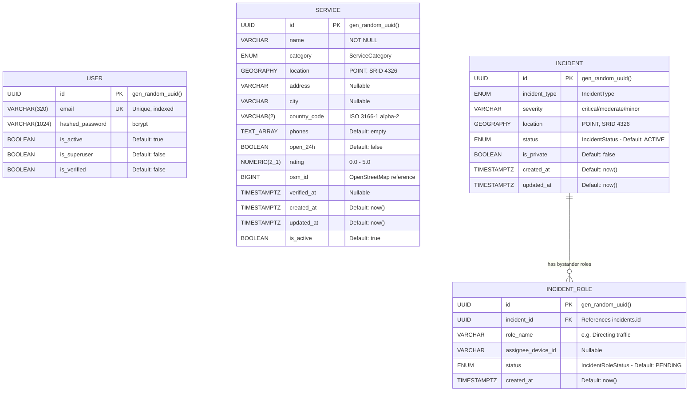

# 🗄️ ROADSoS — Database Architecture

> **Hackathon Submission — Structured Database Documentation**
> PostgreSQL 16 + PostGIS 3.4 • SQLAlchemy 2.0 (Async) • Alembic Migrations • Redis Caching Layer

---

## 1. Architecture Overview

ROADSoS uses a **geospatially-aware relational database** as its core persistence layer. The architecture is designed for a single critical purpose: **finding the nearest emergency service in under 200ms, even under load**.

```
┌──────────────────────────────────────────────────────────────┐
│                       Application Layer                      │
│                   FastAPI + SQLAlchemy 2.0                    │
│                  (async — non-blocking I/O)                   │
└──────────────┬──────────────────────┬────────────────────────┘
               │                      │
        ┌──────▼──────┐        ┌──────▼──────┐
        │ PostgreSQL  │        │    Redis    │
        │  16 + Post  │        │   7 Alpine  │
        │    GIS 3.4  │        │             │
        │             │        │ • Geo cache │
        │ • Services  │        │ • Telemetry │
        │ • Incidents │        │ • Ring buf  │
        │ • Users     │        │             │
        │ • Roles     │        │ TTL: 5 min  │
        └─────────────┘        └─────────────┘
```

### Why This Stack?

| Decision | Rationale |
|---|---|
| **PostgreSQL** | Battle-tested ACID-compliant RDBMS with native UUID support (`gen_random_uuid()`) |
| **PostGIS Extension** | Industry-standard geospatial engine — supports `Geography` types (WGS 84, SRID 4326) for real-world distance calculations on a spheroid, not a flat plane |
| **SQLAlchemy 2.0 (Async)** | Modern `select()` API with `asyncpg` driver for non-blocking database access under concurrent load |
| **GeoAlchemy2** | Pythonic ORM bindings for PostGIS functions (`ST_DWithin`, `ST_Distance`, `ST_MakePoint`, `ST_AsGeoJSON`) |
| **Alembic** | Version-controlled schema migrations — auditable, reversible, CI/CD friendly |
| **Redis** | Sub-millisecond caching for repeated geospatial lookups (geo-hashed keys, 5-minute TTL) |

---

## 2. Entity-Relationship Diagram (ERD)



### Relationship Summary

| Relationship | Type | Description |
|---|---|---|
| `INCIDENT` → `INCIDENT_ROLE` | One-to-Many | Each incident can have multiple bystander roles (e.g., "Directing traffic", "Calling ambulance", "Stay with victim") |
| `INCIDENT_ROLE` → `INCIDENT` | Many-to-One | Each role belongs to exactly one incident, with cascade delete |
| `USER` | Standalone | Admin users for the moderation panel; not FK-linked to incidents in the MVP (device-based identification) |
| `SERVICE` | Standalone | Emergency service points ingested from OpenStreetMap; queried spatially, not relationally joined |

---

## 3. Core Tables — Column-Level Breakdown

### 3.1 `services` — Emergency Service Points

The primary data table. Each row represents a real-world emergency service location (hospital, police station, ambulance depot, etc.) with a PostGIS `Geography(POINT)` column for spatial indexing.

| Column | Type | Constraints | Description |
|---|---|---|---|
| `id` | `UUID` | PK, `gen_random_uuid()` | Globally unique, merge-safe identifier |
| `name` | `VARCHAR` | NOT NULL | Human-readable service name |
| `category` | `ENUM(ServiceCategory)` | NOT NULL | One of: `HOSPITAL`, `POLICE`, `AMBULANCE`, `TOWING`, `TYRE_SHOP`, `CAR_DEALER`, `FIRE_BRIGADE`, `PETROL_PUMP`, `CLINIC`, `SHELTER` |
| `location` | `Geography(POINT, 4326)` | NOT NULL | **PostGIS** — WGS 84 coordinate stored as geography type for spheroidal distance calculations |
| `address` | `VARCHAR` | Nullable | Street address |
| `city` | `VARCHAR` | Nullable | City name |
| `country_code` | `VARCHAR(2)` | NOT NULL | ISO 3166-1 alpha-2 country code |
| `phones` | `TEXT[]` | Default: `{}` | PostgreSQL array of contact phone numbers |
| `open_24h` | `BOOLEAN` | Default: `false` | Whether the service operates 24/7 |
| `rating` | `NUMERIC(2,1)` | Nullable | Community rating (0.0 – 5.0) |
| `osm_id` | `BIGINT` | Nullable | OpenStreetMap node ID for data provenance |
| `verified_at` | `TIMESTAMPTZ` | Nullable | When the service was last verified accurate |
| `created_at` | `TIMESTAMPTZ` | Default: `now()` | Record creation timestamp |
| `updated_at` | `TIMESTAMPTZ` | Default: `now()` | Last modification timestamp (auto-updated) |
| `is_active` | `BOOLEAN` | Default: `true` | Soft-delete flag |

**Indexes:**
- `idx_services_location` — **GiST index** on `location` column for fast spatial queries

---

### 3.2 `incidents` — Emergency Events

Geo-tagged emergency events reported by users in real time.

| Column | Type | Constraints | Description |
|---|---|---|---|
| `id` | `UUID` | PK, `gen_random_uuid()` | Unique incident identifier |
| `incident_type` | `ENUM(IncidentType)` | NOT NULL | One of: `MEDICAL`, `FIRE`, `BREAKDOWN`, `FUEL`, `FLOOD`, `CRIME` |
| `severity` | `VARCHAR` | Nullable | Triage level: `critical`, `moderate`, `minor` |
| `location` | `Geography(POINT, 4326)` | NOT NULL | **PostGIS** — Incident location |
| `status` | `ENUM(IncidentStatus)` | NOT NULL, Default: `ACTIVE` | `ACTIVE` or `RESOLVED` |
| `is_private` | `BOOLEAN` | NOT NULL, Default: `false` | If true, not visible to nearby bystanders |
| `created_at` | `TIMESTAMPTZ` | Default: `now()` | When the incident was reported |
| `updated_at` | `TIMESTAMPTZ` | Default: `now()` | Last status change |

---

### 3.3 `incident_roles` — Bystander Coordination

Allows multiple bystanders to self-assign roles during a public incident.

| Column | Type | Constraints | Description |
|---|---|---|---|
| `id` | `UUID` | PK, `gen_random_uuid()` | Unique role identifier |
| `incident_id` | `UUID` | FK → `incidents.id`, NOT NULL | Parent incident |
| `role_name` | `VARCHAR` | NOT NULL | e.g., "Directing traffic", "Calling ambulance", "Stay with victim" |
| `assignee_device_id` | `VARCHAR` | Nullable | Device identifier of the bystander who claimed this role |
| `status` | `ENUM(IncidentRoleStatus)` | NOT NULL, Default: `PENDING` | `PENDING` (unclaimed) or `ASSIGNED` (claimed) |
| `created_at` | `TIMESTAMPTZ` | Default: `now()` | When the role was created |

**Cascade:** Deleting an incident automatically deletes all associated roles (`cascade="all, delete-orphan"`).

---

### 3.4 `user` — Admin / Authenticated Users

Managed by `fastapi-users` library — provides registration, login, password reset, and verification out of the box.

| Column | Type | Constraints | Description |
|---|---|---|---|
| `id` | `UUID` | PK | User identifier |
| `email` | `VARCHAR(320)` | UNIQUE, Indexed | Login email |
| `hashed_password` | `VARCHAR(1024)` | NOT NULL | bcrypt hash |
| `is_active` | `BOOLEAN` | NOT NULL | Account active flag |
| `is_superuser` | `BOOLEAN` | NOT NULL | Admin access flag |
| `is_verified` | `BOOLEAN` | NOT NULL | Email verification flag |

**Indexes:**
- `ix_user_email` — Unique B-tree index on `email`

---

## 4. Enum Definitions

### `ServiceCategory`
```sql
CREATE TYPE service_category AS ENUM (
    'HOSPITAL',      -- Medical facilities
    'POLICE',        -- Law enforcement
    'AMBULANCE',     -- Emergency medical transport
    'TOWING',        -- Vehicle towing services
    'TYRE_SHOP',     -- Tyre repair shops
    'CAR_DEALER',    -- Authorized car dealerships
    'FIRE_BRIGADE',  -- Fire departments
    'PETROL_PUMP',   -- Fuel stations
    'CLINIC',        -- Walk-in clinics
    'SHELTER'        -- Emergency shelters
);
```

### `IncidentType`
```sql
CREATE TYPE incident_type AS ENUM (
    'MEDICAL',       -- Medical emergency
    'FIRE',          -- Fire incident
    'BREAKDOWN',     -- Vehicle breakdown
    'FUEL',          -- Fuel emergency
    'FLOOD',         -- Flood / natural disaster
    'CRIME'          -- Crime in progress
);
```

### `IncidentStatus`
```sql
CREATE TYPE incident_status AS ENUM (
    'ACTIVE',        -- Incident is ongoing
    'RESOLVED'       -- Incident has been resolved
);
```

### `IncidentRoleStatus`
```sql
CREATE TYPE incident_role_status AS ENUM (
    'PENDING',       -- No bystander assigned yet
    'ASSIGNED'       -- A bystander has claimed this role
);
```

---

## 5. PostGIS — Geospatial Indexing & Queries

### 5.1 Why Geography (Not Geometry)?

ROADSoS uses the `Geography` type (not `Geometry`) because:

- **Geography** operates on the WGS 84 spheroid (SRID 4326) — distances are computed as **real-world meters** on the curved surface of the Earth.
- **Geometry** assumes a flat Cartesian plane — fast but inaccurate for distances > a few kilometers.
- For an emergency app operating globally, accuracy of distance calculations is non-negotiable.

### 5.2 Spatial Index (GiST)

```sql
CREATE INDEX idx_services_location
    ON services
    USING gist (location);
```

The **GiST (Generalized Search Tree)** index enables O(log n) spatial lookups instead of full-table scans. Without it, a "find nearest hospital" query against 100K rows would scan every single row.

### 5.3 Core Spatial Queries

#### Finding Nearby Services (Radius Search)

```python
# Python (SQLAlchemy + GeoAlchemy2)
from geoalchemy2.functions import ST_DWithin

point = func.ST_MakePoint(lng, lat)                    # Create a point from user's coordinates
point_geog = func.cast(point, Service.location.type)   # Cast to Geography type

query = select(Service).where(
    ST_DWithin(Service.location, point_geog, 25000),   # Within 25km radius
    Service.is_active.is_(True)
)
```

**Equivalent SQL:**
```sql
SELECT *
FROM services
WHERE ST_DWithin(
    location,                         -- PostGIS Geography column
    ST_MakePoint(-122.41, 37.77)::geography,  -- User's location
    25000                             -- 25,000 meters = 25km
)
AND is_active = true
ORDER BY ST_Distance(location, ST_MakePoint(-122.41, 37.77)::geography);
```

#### Distance Calculation

```python
# Returns distance in kilometers
(func.ST_Distance(Service.location, point_geog) / 1000).label("distance_km")
```

`ST_Distance` on `Geography` types returns **meters** (not degrees). We divide by 1000 for the API response.

#### GeoJSON Export

```python
func.ST_AsGeoJSON(Service.location).label("coordinates")
# Returns: {"type": "Point", "coordinates": [72.8777, 19.0760]}
```

Used to serialize PostGIS geometry into standard GeoJSON for the frontend map layer.

---

## 6. Redis Caching Layer

Redis supplements PostgreSQL as a hot-path cache to avoid redundant spatial queries.

### Cache Patterns

| Key Pattern | TTL | Data | Purpose |
|---|---|---|---|
| `geo:nearby:{geohash}:{category}` | 300s (5 min) | JSON array of services | Cache repeated nearby lookups for the same approximate location |
| `telemetry:{device_id}` | 86400s (24h) | Ring buffer (last 3 pings) | Real-time device tracking with fixed-size list (LPUSH + LTRIM) |

### Geohash Strategy

```python
def get_geohash(lat: float, lng: float):
    return f"{round(lat, 2)}:{round(lng, 2)}"
```

Coordinates are rounded to 2 decimal places (~1.1km precision), creating a grid-based cache key. Users within the same ~1km² cell share the same cache entry.

---

## 7. Migration History

| Revision | Description | Date |
|---|---|---|
| `1a2b3c4d5e6f` | Initial migration — `services`, `user` tables, GiST spatial index, `service_category` enum | 2026-05-30 |

Migration files are located in `alembic/versions/` and are managed via:

```bash
# Generate a new migration
alembic revision --autogenerate -m "description"

# Apply migrations
alembic upgrade head

# Rollback one step
alembic downgrade -1
```

---

## 8. Submission Folder Contents

```
hackathon_db_submission/
├── database_architecture.md          ← This document
├── roadsos_database.sql              ← Full pg_dump (schema + PostGIS extensions)
└── models/
    ├── base_class.py                 ← SQLAlchemy declarative base
    ├── user.py                       ← User model (FastAPI-Users)
    ├── service.py                    ← Service model (10 categories, PostGIS)
    ├── incident.py                   ← Incident + IncidentRole models
    └── 1a2b3c4d5e6f_initial_migration.py  ← Alembic migration script
```
